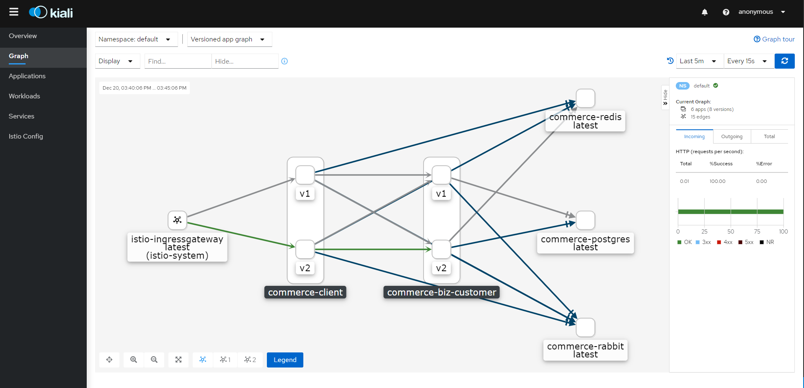

# Istio Gateway操作說明

* 檢查Istio Gateway的入口IP和端口

  如果`EXTERNAL-IP`值為<none>（或永久<pending>），則您的環境不為入口網關提供外部負載平衡器。

  ```sh
  kubectl get services istio-ingressgateway -n istio-system
  ```

  * 方法一

    ```sh
    ingress_port=$(sudo kubectl -n istio-system get service istio-ingressgateway -o jsonpath='{.spec.ports[?(@.name=="http2")].nodePort}')
    ingress_host=$(sudo kubectl get po -l istio=ingressgateway -n istio-system -o jsonpath='{.items[0].status.hostIP}')
    
    echo "Gateway url : ${ingress_host}:${ingress_port}"
    ```


  * 方法二: 修改`EXTERNAL-IP`

成功結果如圖:

<p align="center"></p>